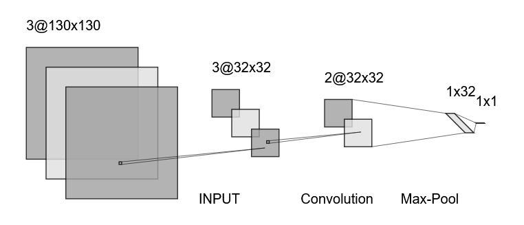
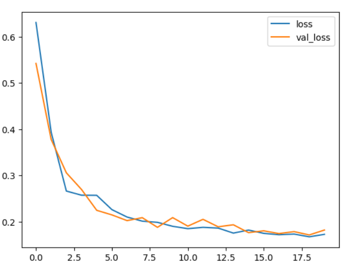
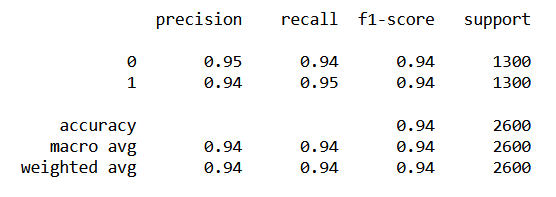
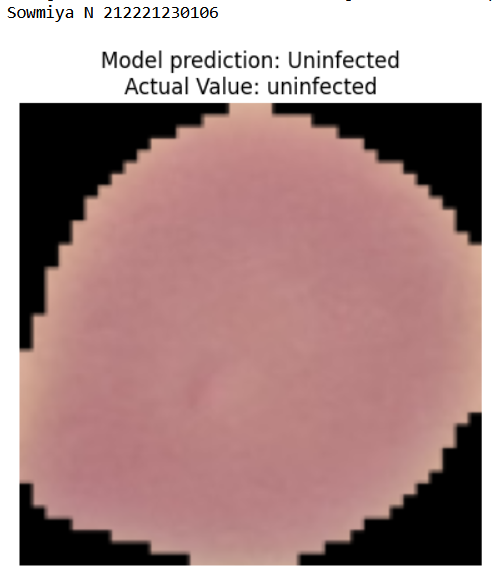
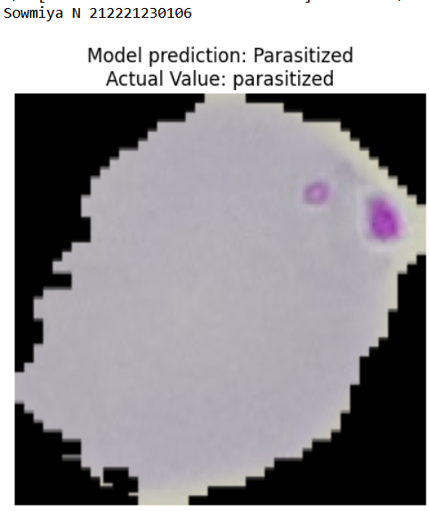

# Deep Neural Network for Malaria Infected Cell Recognition

## AIM

To develop a deep neural network for Malaria infected cell recognition and to analyze the performance.

## Problem Statement and Dataset
Develop a deep neural network for Malaria infected cell recognition. Dataset comprises labeled blood smear images of infected and uninfected cells. Objective: to automate malaria diagnosis for timely treatment.

## Neural Network Model



## DESIGN STEPS

### STEP 1:
Install necessary libraries and import required modules.
### STEP 2:
Load dataset, visualize sample images, and explore dataset structure.
### STEP 3:
Set up ImageDataGenerator for augmenting images during training.
### STEP 4:
Build a CNN model architecture using TensorFlow's Keras API.
### STEP 5:
Train the model, save it, evaluate its performance, and visualize training/validation losses.

## PROGRAM

### Name: Sowmiya N

### Register Number: 212221230106
```
pip install matplotlib
import tensorflow as tf
# to share the GPU resources for multiple sessions
from tensorflow.compat.v1.keras.backend import set_session
config = tf.compat.v1.ConfigProto()
config.gpu_options.allow_growth = True # dynamically grow the memory used on the GPU
config.log_device_placement = True # to log device placement (on which device the operation ran)
sess = tf.compat.v1.Session(config=config)
set_session(sess)

%matplotlib inline

pip install seaborn
import os
import pandas as pd
import numpy as np
import seaborn as sns
import matplotlib.pyplot as plt
from matplotlib.image import imread
from tensorflow.keras.preprocessing.image import ImageDataGenerator
from tensorflow import keras
from tensorflow.keras import layers
from tensorflow.keras import utils
from tensorflow.keras import models
from sklearn.metrics import classification_report,confusion_matrix

my_data_dir = './dataset/cell_images'
os.listdir(my_data_dir)
test_path = my_data_dir+'/test/'
train_path = my_data_dir+'/train/'
os.listdir(train_path)
len(os.listdir(train_path+'/uninfected/'))
len(os.listdir(train_path+'/parasitized/'))
os.listdir(train_path+'/parasitized')[0]
para_img= imread(train_path+
                 '/parasitized/'+
                 os.listdir(train_path+'/parasitized')[0])
plt.imshow(para_img)

# Checking the image dimensions
dim1 = []
dim2 = []
for image_filename in os.listdir(test_path+'/uninfected'):
    img = imread(test_path+'/uninfected'+'/'+image_filename)
    d1,d2,colors = img.shape
    dim1.append(d1)
    dim2.append(d2)

sns.jointplot(x=dim1,y=dim2)
image_shape = (130,130,3)
image_gen = ImageDataGenerator(rotation_range=20, # rotate the image 20 degrees
                               width_shift_range=0.10, # Shift the pic width by a max of 5%
                               height_shift_range=0.10, # Shift the pic height by a max of 5%
                               rescale=1/255, # Rescale the image by normalzing it.
                               shear_range=0.1, # Shear means cutting away part of the image (max 10%)
                               zoom_range=0.1, # Zoom in by 10% max
                               horizontal_flip=True, # Allo horizontal flipping
                               fill_mode='nearest' # Fill in missing pixels with the nearest filled value
                              )
image_gen.flow_from_directory(train_path)
image_gen.flow_from_directory(test_path)
from tensorflow import keras
from tensorflow.keras import layers
model = keras.Sequential()
model.add(layers.Input(shape=image_shape))
model.add(layers.Conv2D(filters=32,kernel_size=(3,3),activation='relu'))
model.add(layers.MaxPool2D(pool_size=(2,2)))
model.add(layers.Flatten())
model.add(layers.Dense(32,activation='relu'))
model.add(layers.Dense(1,activation='sigmoid'))
# Write your code here
model.summary()
model.compile(loss='binary_crossentropy',
              optimizer='adam',
              metrics=['accuracy'])
batch_size = 16
train_image_gen = image_gen.flow_from_directory(train_path,
                                               target_size=image_shape[:2],
                                                color_mode='rgb',
                                               batch_size=batch_size,
                                               class_mode='binary')
                                    
train_image_gen.batch_size
len(train_image_gen.classes)
train_image_gen.total_batches_seen
test_image_gen = image_gen.flow_from_directory(test_path,
                                               target_size=image_shape[:2],
                                               color_mode='rgb',
                                               batch_size=batch_size,
                                               class_mode='binary',shuffle=False)
                                        train_image_gen.class_indices
 results = model.fit(train_image_gen,epochs=20,
                              validation_data=test_image_gen
                             )
model.save('cell_model.h5')
model.save('my_model.keras')
losses = pd.DataFrame(model.history.history)
losses[['loss','val_loss']].plot()      
model.metrics_names
model.evaluate(test_image_gen)
pred_probabilities = model.predict(test_image_gen)
test_image_gen.classes
predictions = pred_probabilities > 0.5
print(classification_report(test_image_gen.classes,predictions))
confusion_matrix(test_image_gen.classes,predictions)

import random
import tensorflow as tf
list_dir=["uninfected","parasitized"]
dir_=(random.choice(list_dir))
para_img= imread(train_path+
                 '/'+dir_+'/'+
                 os.listdir(train_path+'/'+dir_)[random.randint(0,100)])
img  = tf.convert_to_tensor(np.asarray(para_img))
img = tf.image.resize(img,(130,130))
img=img.numpy()
pred=bool(model.predict(img.reshape(1,130,130,3))<0.5 )
plt.title("Model prediction: "+("Parasitized" if pred  else "Uninfected")+"\nActual Value: "+str(dir_))
print("Sowmiya N 212221230106")
plt.axis("off")
plt.imshow(img)
plt.show()

import random
import tensorflow as tf
list_dir=["uninfected","parasitized"]
dir_=(random.choice(list_dir))
para_img= imread(train_path+
                 '/'+dir_+'/'+
                 os.listdir(train_path+'/'+dir_)[random.randint(0,100)])
img  = tf.convert_to_tensor(np.asarray(para_img))
img = tf.image.resize(img,(130,130))
img=img.numpy()
pred=bool(model.predict(img.reshape(1,130,130,3))<0.5 )
plt.title("Model prediction: "+("Parasitized" if pred  else "Uninfected")+"\nActual Value: "+str(dir_))
print("Sowmiya N 212221230106")
plt.axis("off")
plt.imshow(img)
plt.show()
```

## OUTPUT

### Training Loss, Validation Loss Vs Iteration Plot



### Classification Report


### Confusion Matrix


### New Sample Data Prediction




## RESULT
Thus a deep neural network for Malaria infected cell recognition and to analyze the performance is developed .